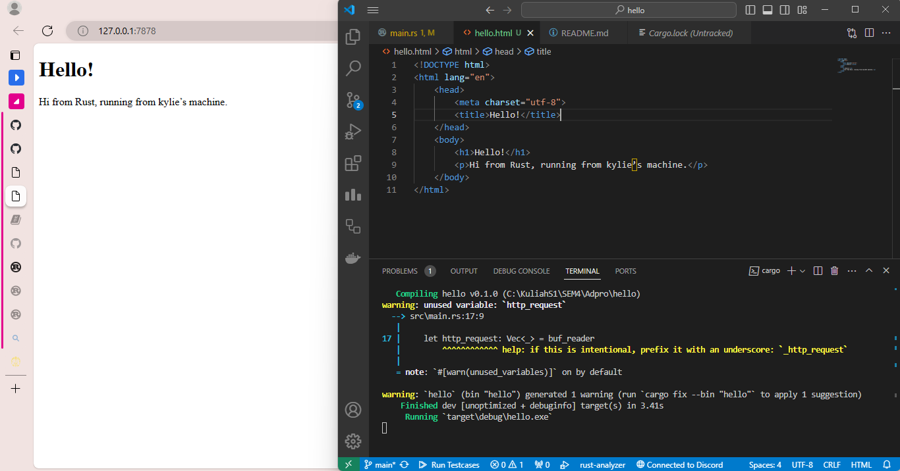
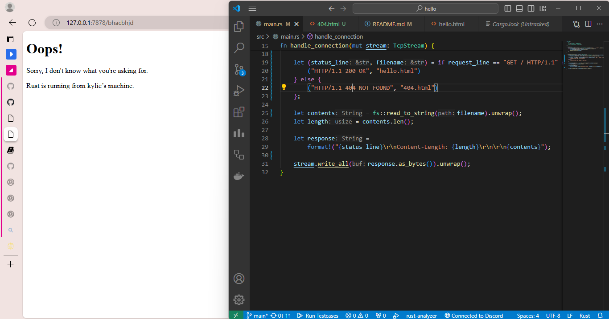

### Milestone 1
Pada method handle_connection diawali dengan BufReader untuk membaca hasil response yang diberikan. BufReader digunakan karena lebih efisien dibandingkan Read instance pada umumnya. Selanjutnya ada ```lines()``` yang berfungsi membuat iterator untuk tiap line yang dibaca oleh instance BufReader. ```map()``` digunakan untuk mengubah iterator yang dihasilkan sebelumnya menjadi iterator baru. Iterator baru ini isinya adalah hasil dari ```result.unwrap()``` yang berupa string. Selanjutnya, ```take_while(|line| !line.is_empty())``` akan membuat iterator dari element-element di iterator sebelumnya dimana isinya adalah element yang memenuhi, dalam kasus ini tidak berupa string kosong. Terakhir, ```collect()``` membuat iterator tadi menjadi sebuah vector.

### Milestone 2
Pada kode tambahan method handle_connection pertama dinyatakan variabel status_line berisi string yang menandakan bahwa response memiliki status berhasil. Selanjutnya, dibuat variabel contents yang membaca isi file hello.html menjadi sebuah string dengan ```fs::read_to_string("hello.html)```. Variabel length dibuat untuk menyimpan panjang dari string contents yang dihitung menggunakan ```len()```. Lalu, semua variabel tadi diformat menjadi sebuah string yang ditampung dalam variabel response


### Milestone 3
Disini ditambahkan kode untuk membedakan response. Hal ini dilakukan dengan cara mengecek line pertama dari response yang dikembalikan menggunakan ```next()``` dimana line pertama ini berisi request apa yang dilakukan. Unwrap berguna untuk menghandle Option dan menghasilkan Result yang di unwrap lagi untuk mendapatkan string. Selanjutnya, menggunakan if else dipisahkan response nya berdasarkan request user tadi. Jika user request 127.0.0.1:7878, maka akan dikembalikan page hello.html. Jika user request apapun selain itu (misalnya 127.0.0.1:7878/kylie), maka akan dikembalikan page 404.html yang tadi dibuat. Terakhir dilakukan refactoring karena banyak code pada if dan else block yang sama sehingga menjadi duplikat. Maka, bagian duplikat dikeluarkan dari if else block dan hanya bagian berbeda yang masuk ke dalam if else block agar tidak terjadi duplikasi kode.
